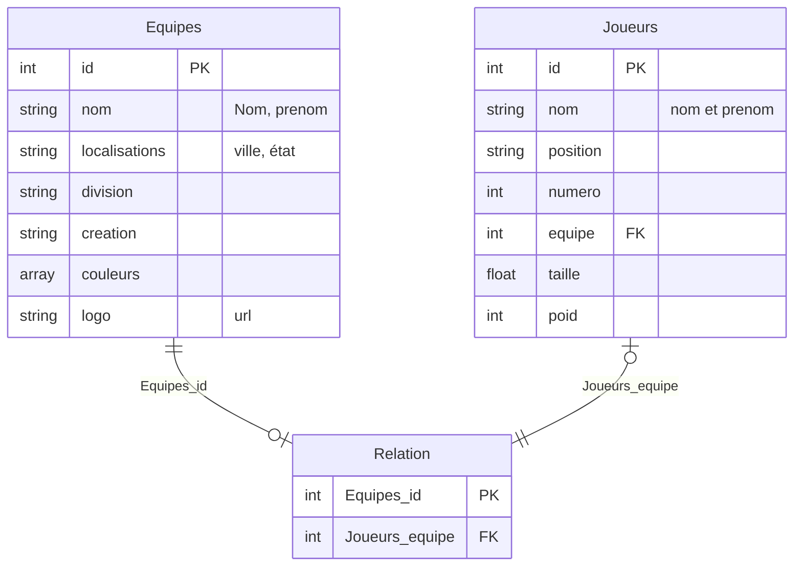
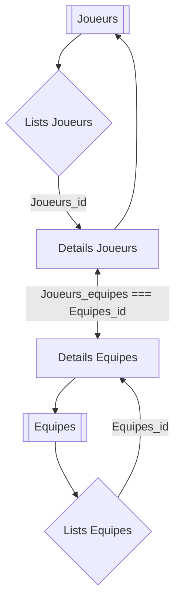

***
### DOCUMENTATION
***
>##### Thème : Basketball
>##### Auteur : LIENHART Michaël
#
#### 1. Présentation des outils :

- **Langages utilisés :**
    - HTML - HyperText Markup Langage
    - CSS - Cascading Style Sheets
    - JS - JavaScript
    - Json - JavaScript Object Notation
    - PHP - Page Hypertext Preprocessor
    - SQL - Structured Query Language
    - API - Application Programming Interface
    - REST - REpresentational State Transfer

- **Logiciel utilisés :**
    - Ubuntu
    - Visual Studio Code
    - phpMyAdmin
    - Gitlab
    - Slack
    - Confluence
    - Badgeuse
    - Lamp

#### 2. Prise en main de Confluence

L'outil Confluence permet le travail collaboratif en équipe / groupe, permettant l'échange d'information, le rendu de travail, en disposant cela d'une agréable organisation et qui permet aussi d'accéder à différents logiciels connexes comme :

- Jira : Un outil de gestion de projet qui permet de planifiez, suivre et publiez des travaux grâce à la méthode agile. 
- Badgeuse : Permet de gérer mieux votre entreprise avec un système de badgeage et pointeuse facile et efficace.
- Gitlab : C'est une plate-forme de développement de logiciel qui automatise toutes les étapes nécessaires pour construire, tester et déployer votre code dans votre environnement de production.
- Slack :  Est une plateforme de communication collaborative propriétaire ainsi qu'un logiciel de gestion de projets.
- Calendrier et Calendrier Master : Permet de gérer votre travail et votre vie personnelle.
- Visio : Le logiciel Jitsi  Meet est une application libre multiplateforme de messagerie instantanée, voix sur IP et visioconférence.
- Remonté des problèmes : Un formulaire de contact pour les éventuelles problème durant la formation à l'UHA 4.0.
- Espace : Permet d'accéder au répertoire des espaces et aux différents espaces récemment utilisés.
- Personnes: Un répertoire de tous les individus disposant d'un espace personnel.
- Questions: Permet de poser des questions et donc d'avoir des réponses.
- Calendriers: Permet de gérer votre travail et votre vie personnelle.
- Analytics: Des données , des statistiques pour les scientifiques des datas.

Les pages étant répertorié par niveau cela est visuellement très visible, pour ce qui est de mon 'Fil Rouge' il est intitulé 'Fil rouge 4.0.1'.
Ont peut y trouver aussi beaucoup de lien pour améliorer ses connaissances.
Ce dossier 'Fil rouge 4.0.1' décrit plusieurs point : préface, objectif, compétences à valider, tâches à réaliser et une roadmap. Il donne accès à plusieurs sous rubriques:
- API's du fil rouge 4.0.1  qui présentent les différents thèmes d'API , mais qu'est ce qu'une API et administrer une API.
- Documentations des étudiants 4.0.1: ce dossier regroupe les pages qu'on créée les étudiants.
- Git et UHA4.0 décrit à quoi sert 'GIT' , comment créé un 'repository GIT' et son utilisation.
- Thèmes sélectionnés : Présente un tableaux ou sont répertorié les étudiants avec le thème qu'il sont choisi.
#### 3. Thème choisi :
Le thèmes que j'ai choisi est celui du **basketball**.
>**Basket-ball** - Basketball (source : wikipedia)
>
>Le basket-ball ou basketball, fréquemment désigné par son abréviation basket, est un sport collectif de balle opposant deux équipes de cinq joueurs sur un terrain rectangulaire. 
>**Fédération internationale :** FIBA (fondée en 1932).
>Sport olympique depuis 1936 pour les hommes (en démonstration en 1904), 1976 pour les femmes 2020 pour le Basket-ball à trois.
>**Autre appelations :** ballon-panier (Canada).
>**Joueurs licenciés :** environ 100 millions.
>**Joueurs pratiquants :** environ 450 millions (est. de 2007).
>**Champions du monde en titre :** Allemagne (homme) , Etats-Unis (femme).
#### 4. Fichiers API JSON :
JSON : **J**ava**S**cript **O**bject **N**otation
- Fichiers JSON de l'API sont disponible à l'adresse :
 equipes - https://filrouge.uha4point0.fr/V2/basketball/equipes
 joueurs - https://filrouge.uha4point0.fr/V2/basketball/joueurs
 basketball - https://filrouge.uha4point0.fr/V2/reset/basketball?
- Schémas

#### 5. Objectif :
L'objectif est défini par par le fil rouge 401 est la conception de site web sous diverses technologie déployable sur un serveur apache.
#### 6. Cahier des charges :
Le projet consistera à la conception de divers site web, application et service utilisant les données fourins par l'API de l'UHA. L'affichage de ces données est représenté de la manière suivantes :

- Couleurs utilisé :
    - #333
    - #D2691E - Chocolate
    - #FFF - White
    - #FFB2B
- Emoticone :
    - CSS : \1F3C0
#
>###### 4.0.1 - Fil Rouge - UHA 4.0 - 2023