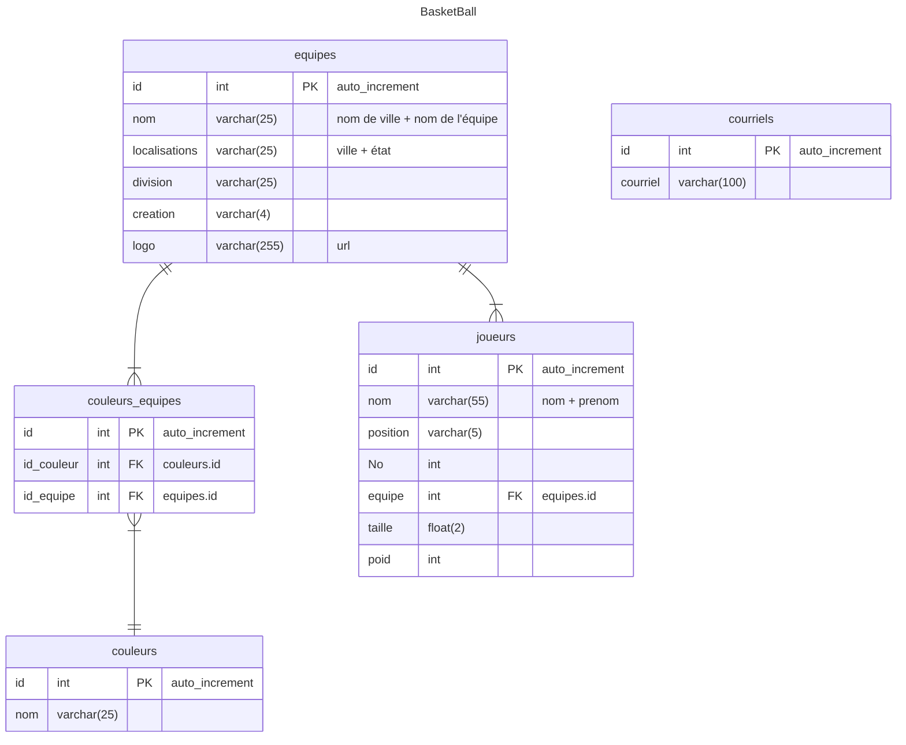
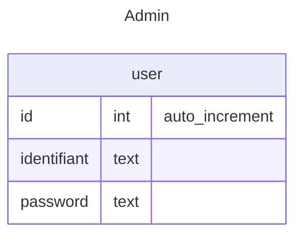

***
### DOCUMENTATION
***
>##### Thème : Basketball
>##### Auteur : LIENHART Michaël
#
Voici le fichier de la base de données.

```mermaid
---
title: BasketBall
---
erDiagram
    equipes {
        id int PK "auto_increment"
        nom varchar(25) "nom de ville + nom de l'équipe"
        localisations varchar(25) "ville + état"
        division varchar(25)
        creation varchar(4)
        logo varchar(255) "url"
    }
    couleurs {
        id int PK "auto_increment"
        nom varchar(25)
    }
    couleurs_equipes {
        id int PK "auto_increment"
        id_couleur int FK "couleurs.id"
        id_equipe int FK "equipes.id"
    }
    joueurs {
        id int PK "auto_increment"
        nom varchar(55) "nom + prenom"
        position varchar(5)
        No int
        equipe int FK "equipes.id"
        taille float(2)
        poid int
    }
    courriels {
        id int PK "auto_increment"
        courriel varchar(100)
    }
    equipes ||--|{ couleurs_equipes : ""
    couleurs_equipes |{--|| couleurs : ""
    equipes ||--|{ joueurs : ""
```

```mermaid
---
title: Admin
---
erDiagram
    user {
        id int "auto_increment"
        identifiant text
        password text
    }
```
>###### 4.0.1 - Fil Rouge - UHA 4.0 - 2023